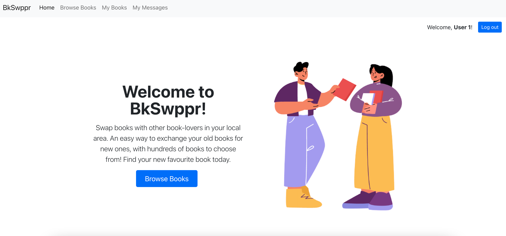
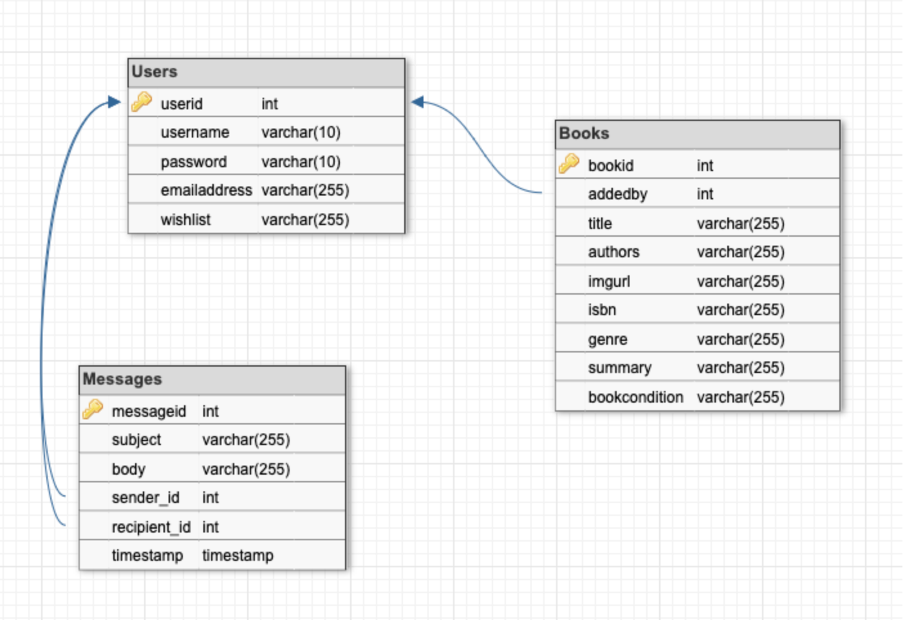
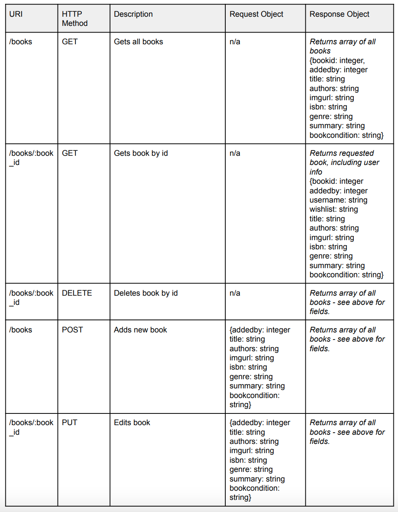
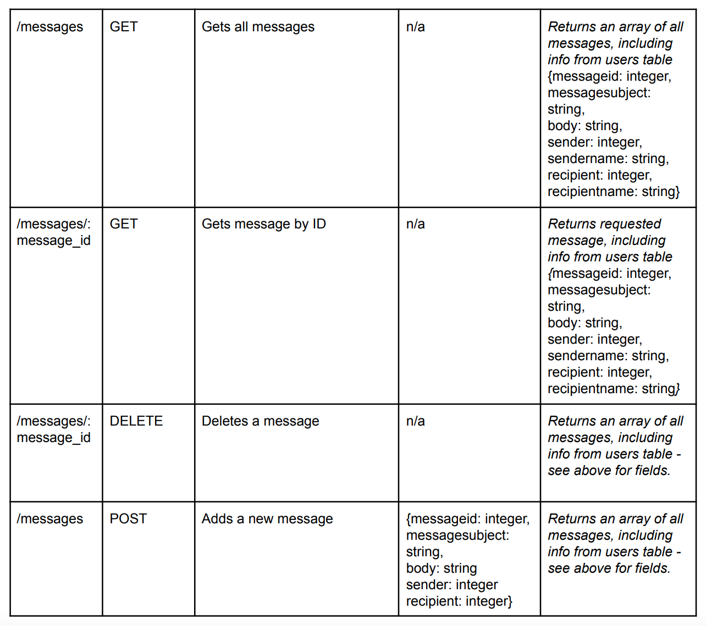
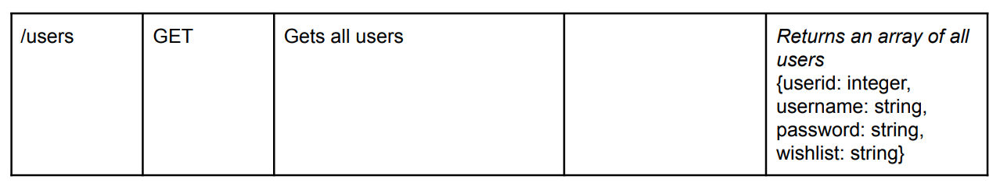

# Book Swapper

## Summary

An app that allows booklovers to swap their used books.

## Table of Contents

1. About the Project
2. Technologies Used
3. Database Schema
4. API Routes
5. Acknowledgements

<!-- ABOUT THE PROJECT -->
## About The Project

It can be difficult to get books in English in Barcelona, especially if you prefer to shop local. Using this app, readers can swap books in English, rather than taking up more space in their tiny apartments!

## Installation instructions

### Setting up your local repository

1. Fork the repo into your GitHub. Copy the address and run git clone to save a local version on your computer.
2. In the terminal, cd into the project folder. Run 'yarn' to install dependencies.
3. cd into the client folder. Run 'yarn' to install dependencies.
4. cd back into the project folder. Create a .env folder with the following content (change the password if you used a different password for MySQL):
DB_HOST=localhost
DB_USER=root
DB_PASS=root
DB_NAME=bookswap
5. Run 'yarn migrate' to fill the database with dummy information.
6. In the project folder, run 'yarn start' to start the server.
7. cd into the client folder. Run 'yarn start' to start the client app.

### Setting up your Google Books API Key

1. To use the external API part of the app, you need to get a Google API key using [these instructions](https://developers.google.com/books/docs/v1/using#APIKey).
2. Create a .env file in the client folder containing the following: REACT_APP_API_KEY=[ Your API key goes here ].

## Technologies Used

* Front end built with [React.js](https://reactjs.org/) and [React Router](https://reactrouter.com/)
* Back end built with [Express.js](https://expressjs.com/)

## Database Schema

## API Routes

The below tables summarise the routes used in the back-end API.

### Books Table

As shown below, the book table includes GET, GET by id, PUT, POST, and DELETE routes.

### Messages Table

As shown below, the messages table includes GET, GET by id, POST, and DELETE routes.

### Users Table

As shown below, the users table includes only a GET route at this stage.

<!-- ROADMAP -->

## Roadmap

Features that I'd like to add to the app in the future include:

-[] User authentication
-[] Search functionality on the "Browse Books" view
-[] Ability for users to save books that they are interested in
-[] Ability for users to upload images from their computer

<!-- ACKNOWLEDGMENTS -->
## Acknowledgments

* Home page graphic created by upklyak and sourced from [Freepik.com](https://www.freepik.com/vectors/people-book)
* 404 page graphic from [Craftwork](http://www.craftwork.design)

_This is a student project that was created at [CodeOp](http://codeop.tech), a full stack development bootcamp in Barcelona._

[Back to Top](#book-swapper)
